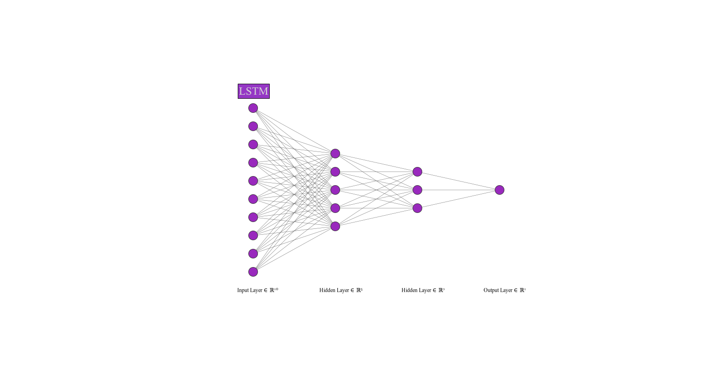
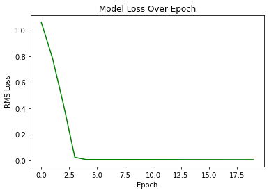
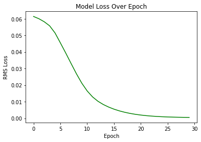
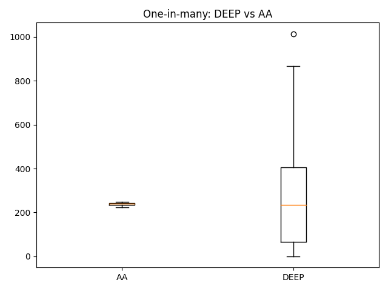
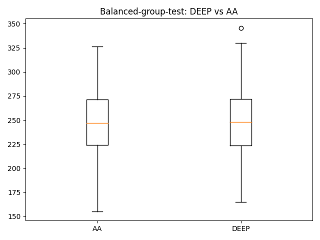
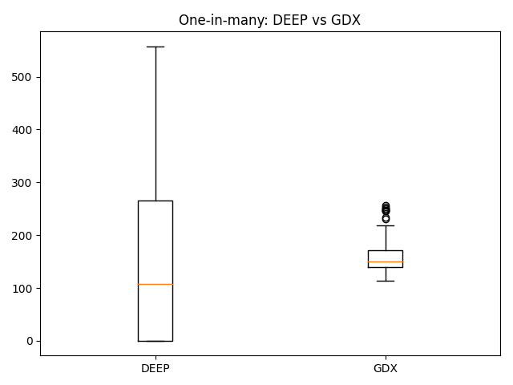
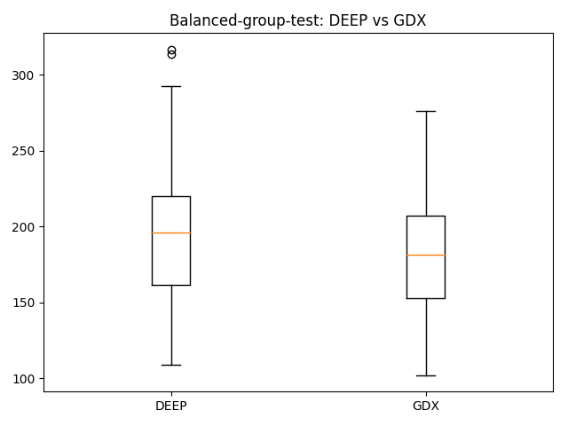
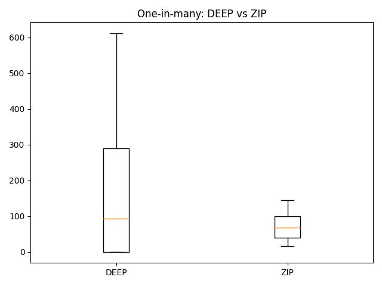
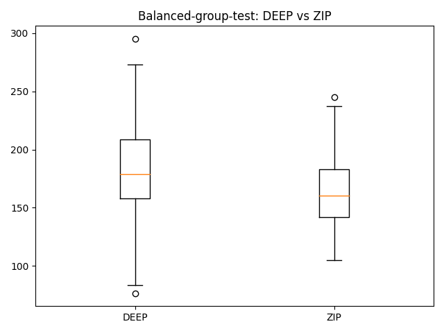

# DeepTrader Overview
This is an implementation of [Automated Creation of a High-Performing Algorithmic Trader via Deep Learning on Level-2 Limit Order Book Data](https://arxiv.org/abs/2012.00821).

## Executing This Repo

To run all 14 tests for a trained model, run the following command with a \<model_type> of either "DEEP" or "RDT":

`python main.py test <model_type>`

To generate snapshot data by running BSE simulations for all 1225 market configurations \<n> times:

`python make.py generateData <n>`

To normalize generated snapshot data from \<filepath>:

`python make.py normalize <filepath>`

To generate normalized snapshots from real-world lobster data for a file located at \<filepath>, with ticker symbol \<tkr>:

`python make.py processLobster <filepath> <tkr>`

Our colab model training notebook is located
[here](https://colab.research.google.com/drive/1kkldIs1-KotjtKKA9-GPsJjdo6Ic7SdO#scrollTo=VdjOspdAaQHR).


## Introduction
The authors' motivation for their work is to develop a deep learning neural network that can automatically learn to be a high-performing algorithmic trading system.  This model would operate purely from market-data inputs generated by passively oberserving an existing trader and then learn to replicate that trader's actions in the form of issuing a stream of trade quotes for a given trading session.  These orders should lead to a trading performance at least as good as as the trader being replicated.  Limit Order Book Level 2 (LOB2) snapshot data was used to generate features for training, and the authors demonstrated their novel approach being implemented successfully against a range of algorithmic traders for the first time.

Using LOB2 data from simulated market sessions, we succesfully built and trained a deep neural network trader dubbed DeepTrader, which replicated or outperformed 13/14 existing algorithmic traders specified in the paper, matching the performance of the original authors.

In the following sections, we will discuss how we generated our training data, our code implementation of the paper's methods, and our final results.

## Implementation



The model architecture consists of a Long Short Term Memory (LSTM) input layer of size 10, followed by 3 fully connected hiden layers of size 5, 3, and 1, respectively.  ReLU activation was used between every layer, as well as an Adam optimizer with an initial learning rate of 5.5e-5.  To start, we define the forward pass:

```python
import numpy as np
import pandas as pd
import torch
import torch.nn as nn
import torch.nn.functional as F
import torch.optim as optim
import progressbar
from torch.utils.data import DataLoader
import matplotlib.pyplot as plt

class DeepTrader_Model(nn.Module):
    def __init__(self):
        super(DeepTrader_Model, self).__init__()
        
        # LSTM layer 
        self.lstm = nn.LSTM(13, 10)
        
        # First fully connected layer
        self.fc1 = nn.Linear(10, 5)
        
        # Second fully connected layer
        self.fc2 = nn.Linear(5, 3)
        
        # Third fully connected layer - output
        self.fc3 = nn.Linear(3, 1)
        
    # x represents our data
    def forward(self, x, states):
        
        # Pass data through lstm layer
        x, states = self.lstm(x, states)
        self.states = states
        
        # Use the rectified-linear activation function over x
        x = F.relu(x)

        x = self.fc1(x)
        x = F.relu(x)
        
        x = self.fc2(x)
        x = F.relu(x)
        
        x = self.fc3(x)

        return x, states
```


## Training

Once we had our data process, we began training our model.  Training was done in colab to take advantage of GPU resources, and speed up the training process.  

We trained 2 models:
1) **DeepTrader:**\
We trained this model using the normalized snapshots generated from our BSE simulations.  Training was done for 20 epochs, with a learning rate of 5.5e-5 (chosen after tuning) and a batch size size of 16,384.\
Here is the learning curve for DeepTrader:


2) **RealDeepTrader:**\
This model was trained on the normalized snapshots generated from our real-world LOB data, from Johnson and Johnson, Goldman Sachs, and Walmart.  Training was done for 30 epochs also with a learning rate of 5.5e-5 and batch size of 16,384.\
Here is the learning curve for RealDeepTrader:


## Traders

Our trained models were then used by 2 additional trader classes that were created in the BSE: **Trader_DEEP**, based on the simulated data model, and **Trader_RDT**, based on the real-world data model.

Whenever those traders receive a request for a quote from the BSE, they generate a snapshot of the LOB, normalize it, and run it through their model.  The output from that model is then de-normalized, and issued as a quote price.

## Testing

Rather than testing against a reserved test dataset, tests were done by evaluating the performance of our model-based trader classes in live market simulations.

Two kinds of tests were performed on each model:
1) **One-in-many Test (OMT):**\
This test evaluates how a model holds up when surrounded by a different trader type, by running a market session with 1 buyer and seller from our tested trader type, and 39 buyers and sellers from another trader type.

2) **Balanced Group Test (BGT)**\
This test shows the relative performance of 2 trader types, by running a market session with 20 buyers and sellers of each type.  This is a standard way of comparing the average performance of 2 automated sellers.

These tests were run against all 7 trader types included in the BSE source code:
1) **AA**: Adaptive Aggressive
2) **ZIP**: Zero Intelligence Plus
3) **GDX**: Gjerstadt & Dickhaut eXtended
4) **ZIC**: Zero Intelligence Constrained
5) **GVWY**: Giveaway
6) **SHAVR**: Shaver
7) **SNPR**: Sniper

Each test was run for 100 market sessions, and relative performace was evaluated by "Average Profit Per Trader", which is the average profit each trader type achieved in a given market session.

Two test types across 7 traders means a total of 14 tests were performed.

## Results

##### Trader_DEEP

In 13 of 14 tests DEEP outperformed the opponent trader types.  This matched the results found in the original paper.

Here are example results against **AA**, one of the "super human" traders that has regularly out-performed human traders in market sessions:\



As you can see, the performance of DEEP was aproximately equal to that of AA in both tests.  It should be noted that the BGT test vs AA is one where the original paper under-performed.

However, these are the results vs GDX, another of the high-performing traders in the BSE:\



In the OMT test against GDX our model underperformed.  This was one of the tests in which the original paper outperformed the opponent trader.

In other tests, DEEP clearly outperformed the opponent automated traders.  Here are the tests vs ZIP for example:\



All results for DEEP can be found [here](./Test%20Results/DEEP).

So in the end, our model won or tied 13 out of 14 tests, which is the same number found by the original paper.  The test which was lost though was a different one than the original paper found however, which could be something interesting to explore further.

##### Trader_RDT

Performance of RDT was terrible.  Here is an example vs GVWY, one of the worst traders in the BSE:\


All results for RDT can be found [here](./Test%20Results/RDT).

The most likely cause for this poor performance is simply that patterns learned from real world data cannot transfer well to the simulated BSE marketplace.

There are a number of simplifications made to the BSE relative to a real exchange, including:
1) All bid and ask quantities are restricted to 1
2) Only one stock being traded
3) Markets always start at the same value
4) Each trader can have a maximum of one order per orderbook
5) Traders overwrite older orders with new orders
6) No issues with latency
7) Limited number of traders, meaning bid/ask spreads can be large
8) We have access to customer information for generating training data, which we don't have for the real market data
9) etc.

As a result, this poor performance does not necessarily mean that the BSE is a poor simulation of trading dynamics, or that this approach could not be used in a real market scenario.  It just means the environments are sufficiently different that transfer learning cannot be done effectively.

## Conclusion

Here we have demonstrated, as was done in the original paper, that deep learning "black box" systems can be used to effectively replicate the behavior of traders within an exachange.  By learning from the LOB data available to traders prior to their placing asks and bids, a deep trader can learn to effectively predict what the next closing price of a trade will be, and place a quote at that price.

It should be noted that this was done here learning from automated traders, which typically follow a pattern in their bidding strategies (with the exception of stochastic algorithms like "ZIC").  As a result, whether this works effectively against human actors that may be less predictable should be investigated further.

Additionally we were not able to get good performance out of a trader trained on real world data, but as observed earlier this is likely because of the structural differences between the simulated market and the real market environments.

Nevertheless, performance in this simulation has been strong enough to warrent further study into the efficacy of this approach in the real world.  If a model could be trained on the best performing traders in the actual market, a Deep Trader could learn implicit strategies that give it an edge over other automated methods.

